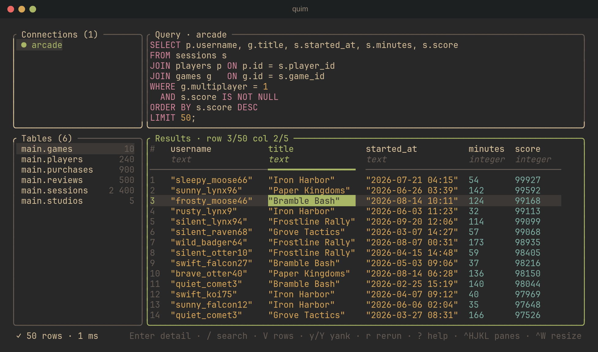

# quim

A terminal UI for running SQL against MSSQL, PostgreSQL and SQLite, built for vim fingers.



## Install

```sh
# Linux / macOS
curl -fsSL https://github.com/HectorBjernersjo/quim/releases/latest/download/install.sh | sh

# Windows (PowerShell)
irm https://github.com/HectorBjernersjo/quim/releases/latest/download/install.ps1 | iex

# From source
cargo install --git https://github.com/HectorBjernersjo/quim
```

## Features

- **One connection string, any engine.** Paste a Postgres URL, an MSSQL connection
  string or a SQLite path; quim works out the engine and whether it points at one
  database or a whole host.
- **Schema-aware autocomplete** for tables, columns and schemas that understands
  aliases: `FROM games g` makes `g.` suggest the right columns.
- **Real vim editing** in the query editor (motions, operators, text objects,
  counts), plus `Ctrl+E` to open the query in `$EDITOR`.
- **Type-colored results** with a cell detail pane that pretty-prints JSON, and
  copying rows as TSV, JSON or a markdown table.
- **Never freezes**: queries run on a worker thread, and dropped connections
  reconnect automatically without re-running writes.

It also plays well with tmux and vim-tmux-navigator: `Ctrl+H/J/K/L` moves between
quim's panes and on into your tmux panes.

## Usage

```sh
quim            # start the TUI
quim --check    # test config, connections and schema without the TUI
```

Press `a` in the sidebar to add a connection, `Enter` to pick a database, write a
query and run it with `Ctrl+R`. `?` shows every key.

See [docs/usage.md](docs/usage.md) for the full key reference, connection
management, the config file and tmux integration.
